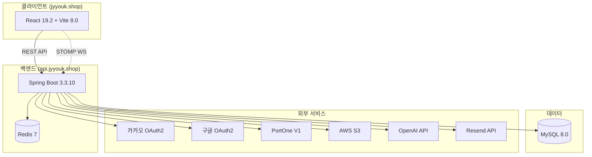

# 주식 대시보드

> 실시간 주식 시세 조회 · 포트폴리오 관리 · AI 종목 분석 웹 애플리케이션

[](https://openjdk.org/projects/jdk/21/)
[](https://spring.io/projects/spring-boot)
[](https://react.dev)
[](https://www.mysql.com/)
[](https://redis.io/)

<!-- CI/CD 배지는 리포지토리 공개 후 실제 워크플로 URL로 교체 필요.
     워크플로 파일: .github/workflows/ci.yml, deploy-backend.yml, deploy-frontend.yml -->


---

## 주요 기능

| 기능 | 설명 |
|------|------|
| **실시간 시세** | WebSocket/STOMP로 주식 시세 실시간 수신 |
| **포트폴리오 관리** | 매수가·수량·손익 계산, 차트 시각화 |
| **목표가 알림** | PRICE_ALERT 기반 목표가 도달 알림 |
| **AI 종목 분석** | OpenAI Responses API 기반 종목 분석 리포트 |
| **소셜 로그인** | 카카오·구글 OAuth2, 기존 계정 자동 연동 |
| **보안 본인인증** | PortOne V1 기반 회원가입·비밀번호 변경·탈퇴 |

---

## 기술 스택

| 영역 | 기술 |
|------|------|
| **Backend** | Java 21, Spring Boot 3.3.10, MyBatis 3.0.3 |
| **Database** | MySQL 8.0, Redis 7 (캐시) |
| **인증/보안** | Spring Security 6, JWT (jjwt 0.12.6), AES-256 |
| **외부 연동** | PortOne V1, Resend API, AWS S3, OpenAI API |
| **실시간** | WebSocket/STOMP, SockJS |
| **Frontend** | React 19.2, Vite 8.0 |
| **상태 관리** | Zustand 5.0, @tanstack/react-query 5.95 |
| **차트** | Chart.js 4.5, lightweight-charts 5.1 |
| **인프라** | AWS EC2, Docker, Nginx, Let's Encrypt, Route53 |
| **관측성** | Actuator, Prometheus, Grafana |

---

## 아키텍처 개요



---

## 빠른 시작

### 필수 조건
- Java 21+
- Node.js 20+
- MySQL 8.0
- Redis 7+ (운영 환경만 필요)
- Docker / Docker Compose (선택)

### 1. 저장소 클론

```bash
git clone <backend-repo-url> stock-dashboard
git clone <frontend-repo-url> stock-dashboard-react
```

### 2. Docker Compose로 전체 기동 (권장)

```bash
cd stock-dashboard
docker-compose up --build
```

- 프론트엔드: http://localhost:5173
- 백엔드: http://localhost:8080

### 3. 개별 실행

**백엔드**

```bash
cd stock-dashboard

# src/main/resources/application-local.properties 파일을 직접 생성하고
# 아래 "환경변수" 섹션의 키를 채워 넣습니다 (예제 파일은 별도로 제공하지 않음).

./mvnw spring-boot:run
# 실행 후: http://localhost:8080
```

**프론트엔드**

```bash
cd stock-dashboard-react

# 프로젝트 루트에 .env.local 파일을 직접 생성하고 아래 항목을 기입합니다.
# VITE_API_BASE_URL=https://localhost:8443

npm install
npm run dev
# 실행 후: http://localhost:5173
```

---

## 환경변수

### 백엔드 (`application-local.properties`)

| 변수 | 설명 | 예시 |
|------|------|------|
| `spring.datasource.url` | MySQL 접속 URL | `jdbc:mysql://localhost:3306/stock_dashboard` |
| `spring.datasource.username` | DB 사용자 | `root` |
| `spring.datasource.password` | DB 비밀번호 | — |
| `jwt.secret.access` | Access Token 서명 키 | 32자 이상 임의 문자열 |
| `jwt.secret.refresh` | Refresh Token 서명 키 | 32자 이상 임의 문자열 |
| `spring.cache.type` | 캐시 타입 | `simple` (로컬) / `redis` (운영) |
| `spring.data.redis.host` | Redis 호스트 | `localhost` |
| `portone.api.key` | PortOne API 키 | — |
| `aws.s3.bucket` | S3 버킷명 | — |
| `openai.api.key` | OpenAI API 키 | — |
| `resend.api.key` | Resend API 키 | — |

### 프론트엔드 (`.env.local`)

| 변수 | 설명 | 예시 |
|------|------|------|
| `VITE_API_BASE_URL` | 백엔드 API 베이스 URL | `https://localhost:8443` |

---

## 스크립트

### 백엔드

| 명령 | 설명 |
|------|------|
| `./mvnw spring-boot:run` | 개발 서버 실행 |
| `./mvnw clean package -DskipTests` | 빌드 (테스트 생략) |
| `./mvnw test` | 전체 테스트 실행 |
| `docker build -t stock-dashboard-backend .` | Docker 이미지 빌드 |

### 프론트엔드

| 명령 | 설명 |
|------|------|
| `npm run dev` | 개발 서버 실행 (포트 5173) |
| `npm run build` | 프로덕션 빌드 |
| `npm run test` | Vitest 테스트 실행 |
| `npm run coverage` | 커버리지 리포트 생성 |

---

## 배포

### GitHub Actions CI/CD

| 워크플로 | 트리거 | 내용 |
|----------|--------|------|
| `backend/ci.yml` | PR → main | JDK 21 + Maven 캐시 + 테스트 + Surefire 리포트 |
| `frontend/ci.yml` | PR → main | Node 20 + ESLint + Vitest + 빌드 + dist 아티팩트 |
| `backend/deploy-backend.yml` | push → main | SSH → mvn package → systemctl restart + 헬스체크 |
| `frontend/deploy-frontend.yml` | push → main | 빌드 → SCP → nginx 원자 교체 + reload |

### 운영 서버 정보

| 구분 | 도메인 | IP |
|------|--------|----|
| 프론트엔드 | jyyouk.shop | 52.79.153.252 (AWS EC2) |
| 백엔드 | api.jyyouk.shop | 3.37.153.11 (AWS EC2) |

---

## 프로젝트 구조

```
stock-dashboard/                    # 백엔드
├── src/main/java/com/stock/dashboard/
│   ├── config/                     # CacheConfig, GlobalExceptionHandler
│   ├── controller/                 # REST API 엔드포인트
│   ├── dao/                        # MyBatis @Mapper 인터페이스
│   ├── dto/                        # 데이터 전송 객체
│   ├── service/                    # 비즈니스 로직
│   ├── scheduler/                  # StockScheduler (시세 수집)
│   ├── JwtUtil.java                # JWT 생성/검증
│   ├── SecurityConfig.java         # Spring Security 설정
│   └── WebSocketConfig.java        # STOMP 설정
└── src/main/resources/mapper/      # MyBatis XML Mapper

stock-dashboard-react/              # 프론트엔드
├── src/
│   ├── api/                        # axiosInstance, services
│   ├── components/                 # 재사용 컴포넌트
│   ├── hooks/                      # useQueries, useAlertSocket 등
│   ├── pages/                      # 페이지 컴포넌트
│   ├── router/index.jsx            # react-router-dom 라우팅
│   ├── store/                      # Zustand (authStore, alertStore)
│   └── styles/                     # CSS Modules
└── docs/                           # 이 문서들
```

---

## 문서

- [포트폴리오 소개서](portfolio-intro.md)
- [API 명세](api-reference.md)
- [시스템 아키텍처](architecture.md)
- [ERD](erd.md)
