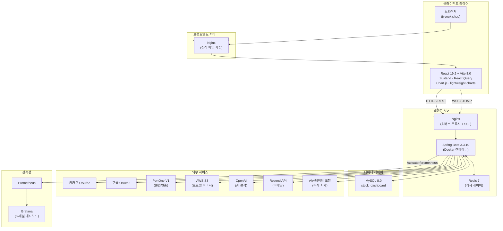
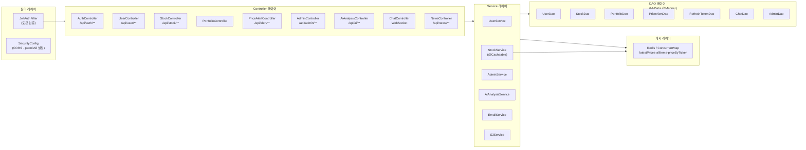
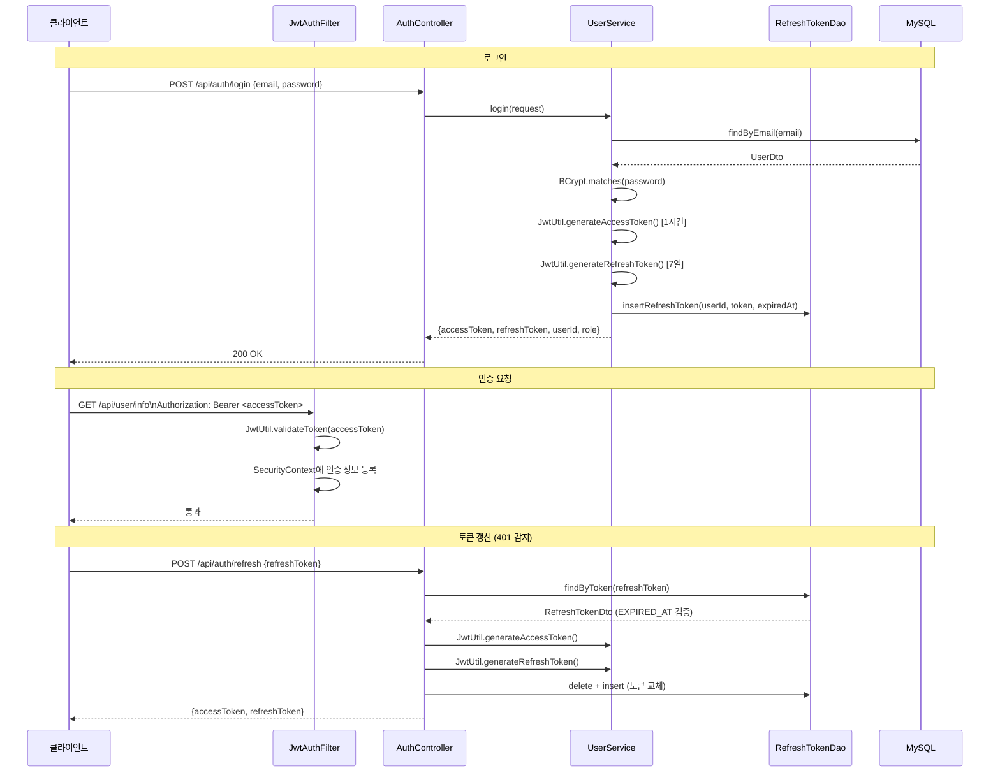
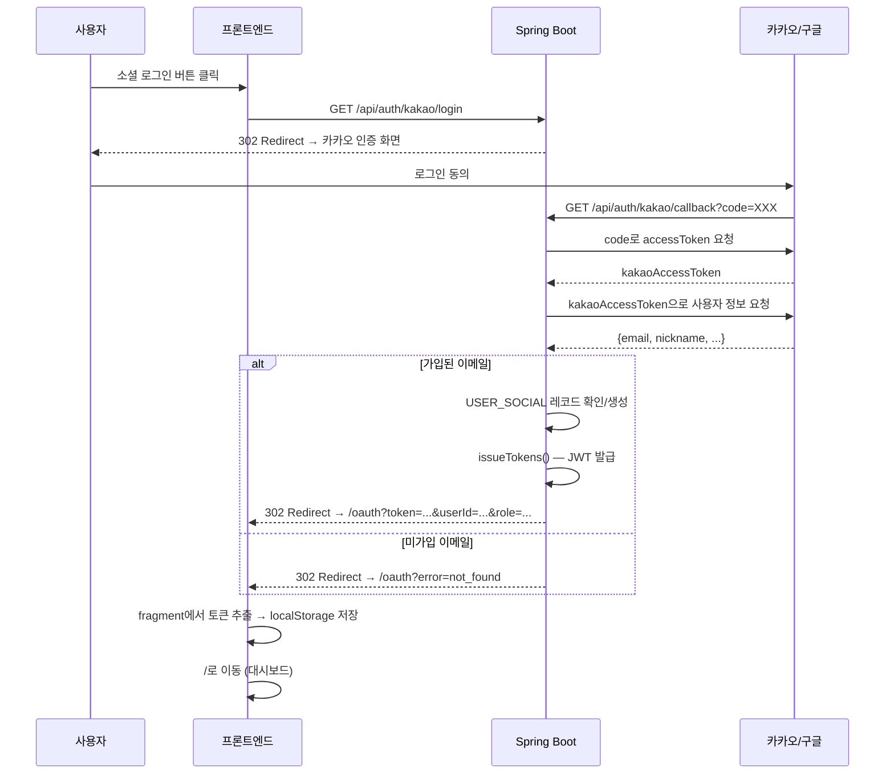
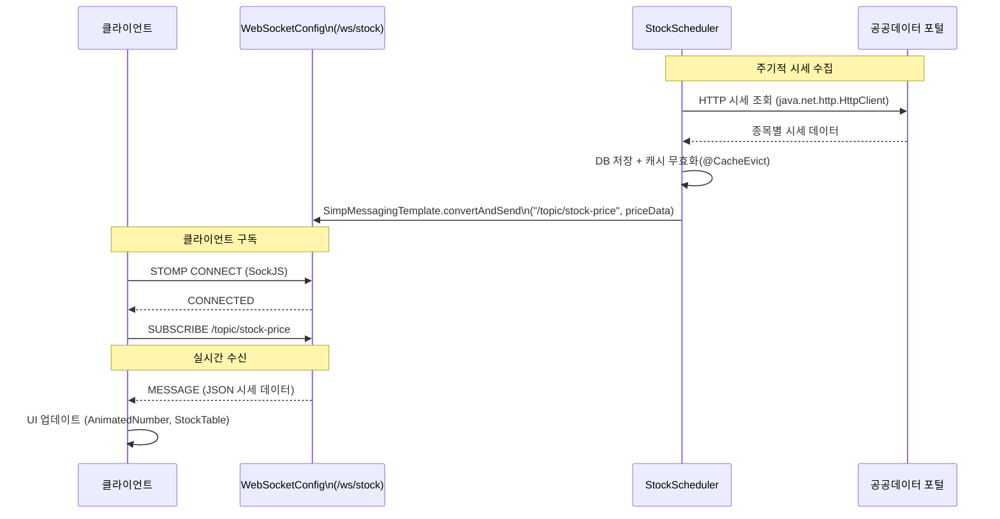
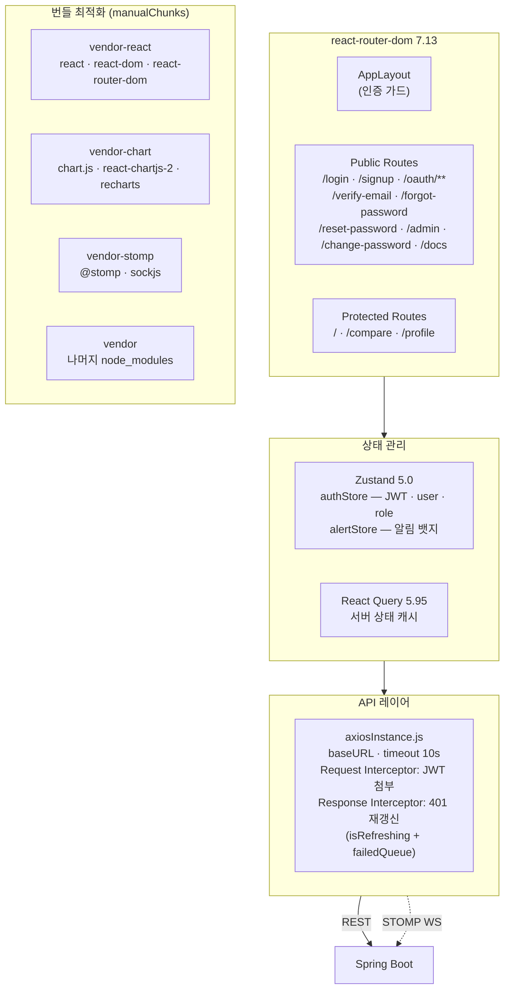

# 시스템 아키텍처

## 1. 전체 시스템 구성도



---

## 2. 백엔드 레이어 구조



---

## 3. JWT 인증 플로우



---

## 4. OAuth2 소셜 로그인 플로우



---

## 5. Redis 캐시 레이어

```mermaid
graph LR
    Client["클라이언트"] -->|GET /api/stock/prices| StockCtrl["StockController"]
    StockCtrl -->|@Cacheable\n'latestPrices'| CacheLayer

    subgraph CacheLayer["캐시 레이어"]
        direction TB
        Check{캐시 히트?}
        Redis[(Redis 7\nstock-dashboard::)]
        ConcurrentMap[(ConcurrentMapCache\n로컬 개발)]
    end

    subgraph TTL["캐시별 TTL"]
        L1["latestPrices\n10분"]
        L2["allItems\n1시간"]
        L3["priceByTicker\n30분"]
        L4["기본\n5분"]
    end

    Check -->|"HIT"| Client
    Check -->|"MISS"| StockSvc["StockService\n(DB 조회)"]
    StockSvc --> MySQL[(MySQL 8.0)]
    MySQL -->|결과 캐시 저장| Redis

    subgraph Profile["프로파일 분기"]
        Local["spring.cache.type=simple\n→ ConcurrentMapCacheManager"]
        Prod["spring.cache.type=redis\n→ RedisCacheManager\n(GenericJackson2JsonRedisSerializer)"]
    end
```

---

## 6. WebSocket 실시간 시세 플로우



---

## 7. 프론트엔드 아키텍처



---

## 인프라 배포 구성

| 구분 | 서버 | 배포 방식 |
|------|------|-----------|
| 프론트엔드 | AWS EC2 (jyyouk.shop) | GitHub Actions → SCP → Nginx 원자 교체 |
| 백엔드 | AWS EC2 (api.jyyouk.shop) | GitHub Actions → SSH → mvn package → systemctl restart |
| DB | 백엔드 서버 내 MySQL | — |
| 컨테이너 | Docker (백엔드) | Dockerfile + docker-compose.yml |
| SSL | Let's Encrypt | Nginx + Certbot |
| DNS | AWS Route53 | A Record |
