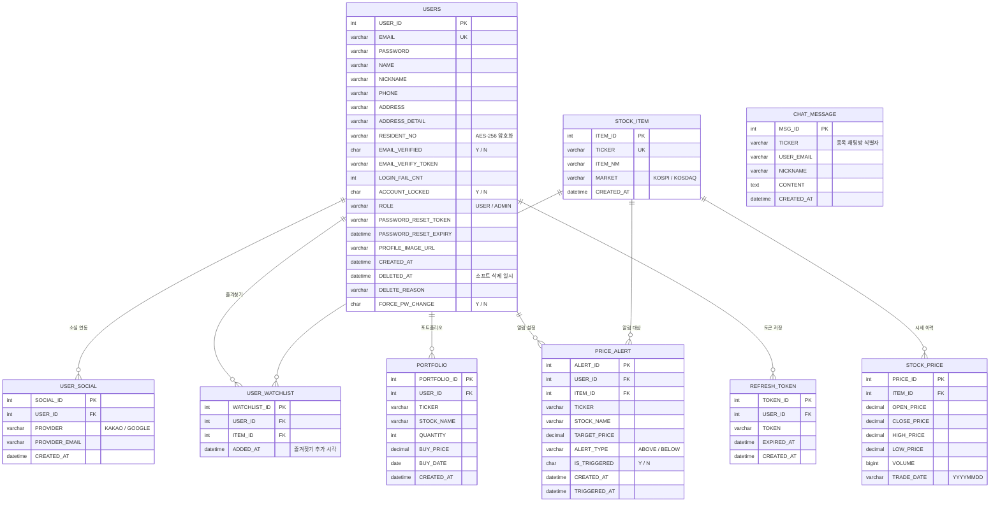

# ERD (Entity Relationship Diagram)

데이터베이스: `stock_dashboard` (MySQL 8.0)

## 테이블 관계도

---

## 테이블 설명

### USERS — 회원

| 컬럼 | 타입 | 설명 |
|------|------|------|
| `USER_ID` | INT PK | 자동 증가 기본키 |
| `EMAIL` | VARCHAR UK | 로그인 ID, 중복 불가 |
| `PASSWORD` | VARCHAR | BCrypt 해시 |
| `RESIDENT_NO` | VARCHAR | AES-256-CBC 암호화 저장 |
| `ROLE` | VARCHAR | `USER` / `ADMIN` |
| `EMAIL_VERIFIED` | TINYINT | 이메일 인증 완료 여부 |
| `LOGIN_FAIL_CNT` | INT | 연속 로그인 실패 횟수 (5회 → 잠금) |
| `ACCOUNT_LOCKED` | TINYINT | 계정 잠금 상태 |
| `DELETED_AT` | DATETIME | NULL이면 활성 계정, 소프트 삭제 일시 |
| `FORCE_PW_CHANGE` | CHAR(1) | `'Y'` → 로그인 후 강제 비밀번호 변경 |

---

### USER_SOCIAL — 소셜 연동

한 사용자가 카카오·구글을 모두 연동할 수 있는 1:N 구조.
`PROVIDER` 값: `KAKAO`, `GOOGLE`

---

### STOCK_ITEM — 종목 마스터

KRX(한국거래소) 기준 종목 코드와 종목명. `MARKET`: `KOSPI`, `KOSDAQ`.

---

### STOCK_PRICE — 주식 시세 이력

`TRADE_DATE`는 `YYYYMMDD` 문자열 (공공데이터 포털 API 형식). STOCK_ITEM과 N:1 관계.

---

### USER_WATCHLIST — 즐겨찾기

`USER_ID` + `ITEM_ID` 복합 유니크로 중복 방지 (INSERT IGNORE INTO 사용). 추가 시각 컬럼명은 `ADDED_AT` (다른 테이블의 `CREATED_AT`과 구분되는 레거시 네이밍).

---

### PORTFOLIO — 포트폴리오

`TICKER`와 `STOCK_NAME`을 비정규화로 저장 (STOCK_ITEM JOIN 없이 빠른 조회). 손익 계산은 서비스 레이어에서 현재가와 비교해 산출.

---

### PRICE_ALERT — 목표가 알림

`ALERT_TYPE`: `ABOVE` (목표가 이상 시 알림) / `BELOW` (목표가 이하 시 알림).
`IS_TRIGGERED`: `CHAR(1)` `'Y'`(발송 완료) / `'N'`(대기). 스케줄러(`StockScheduler`)가 주기적으로 확인.

---

### REFRESH_TOKEN — JWT Refresh Token

서버 사이드 무효화를 위해 DB에 저장. `EXPIRED_AT` 컬럼으로 만료 검증.
토큰 갱신 시 기존 레코드 삭제 후 신규 삽입 (Rolling Token 방식).

---

### CHAT_MESSAGE — 종목 채팅방 메시지 (실시간 채팅)

종목별 실시간 채팅방의 사용자 간 메시지 저장소. `ChatController` WebSocket(`/app/chat/{ticker}`)으로 수신한 메시지를 `chatDao.insertMessage`로 저장 후 `/topic/chat/{ticker}`로 브로드캐스트한다. AI 분석(`/api/ai/analyze`) 호출 이력은 별도로 영속화하지 않으며 이 테이블과 무관하다.

`TICKER` 컬럼으로 종목 채팅방을 구분. STOCK_ITEM과 외래키 없이 비정규화 (독립적 저장, 채팅 삭제 시 종목 정보 영향 없음).

---

## 주요 설계 결정

| 결정 | 이유 |
|------|------|
| `PORTFOLIO.TICKER` 비정규화 | STOCK_ITEM과 JOIN 없이 포트폴리오 조회 성능 확보 |
| `USERS.RESIDENT_NO` AES-256 | 개인정보보호법 준수 — 주민등록번호 원문 저장 금지 |
| `USERS.DELETED_AT` 소프트 삭제 | 2주 복구 기간 보장, 데이터 분석 보존 |
| `REFRESH_TOKEN` DB 저장 | 서버 사이드 무효화 (로그아웃·탈취 감지 대응) |
| `CHAT_MESSAGE.TICKER` 비정규화 | 채팅 이력 독립 보존, 종목 삭제 영향 없음 |
